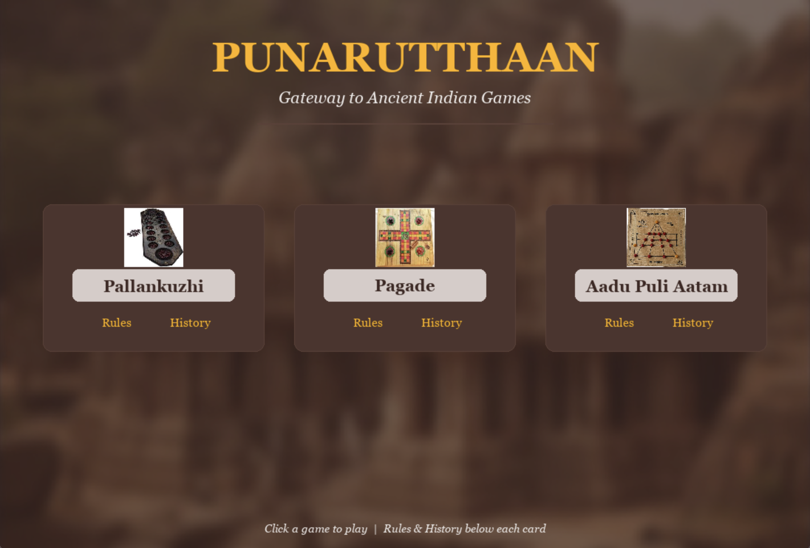
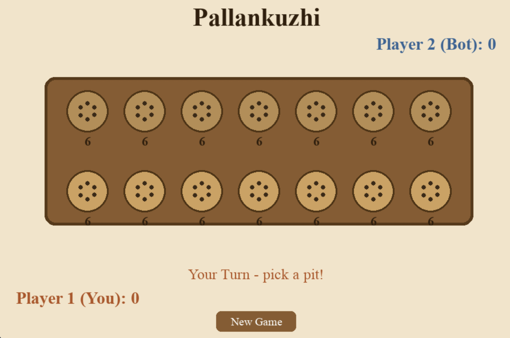
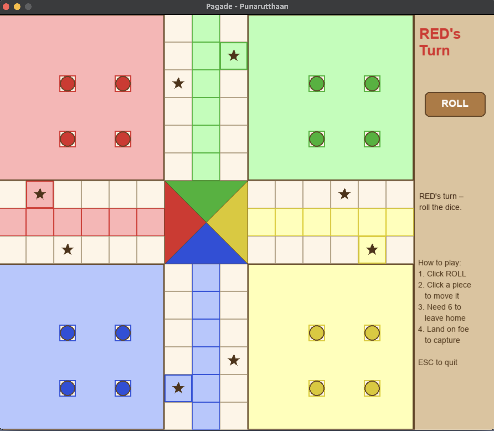
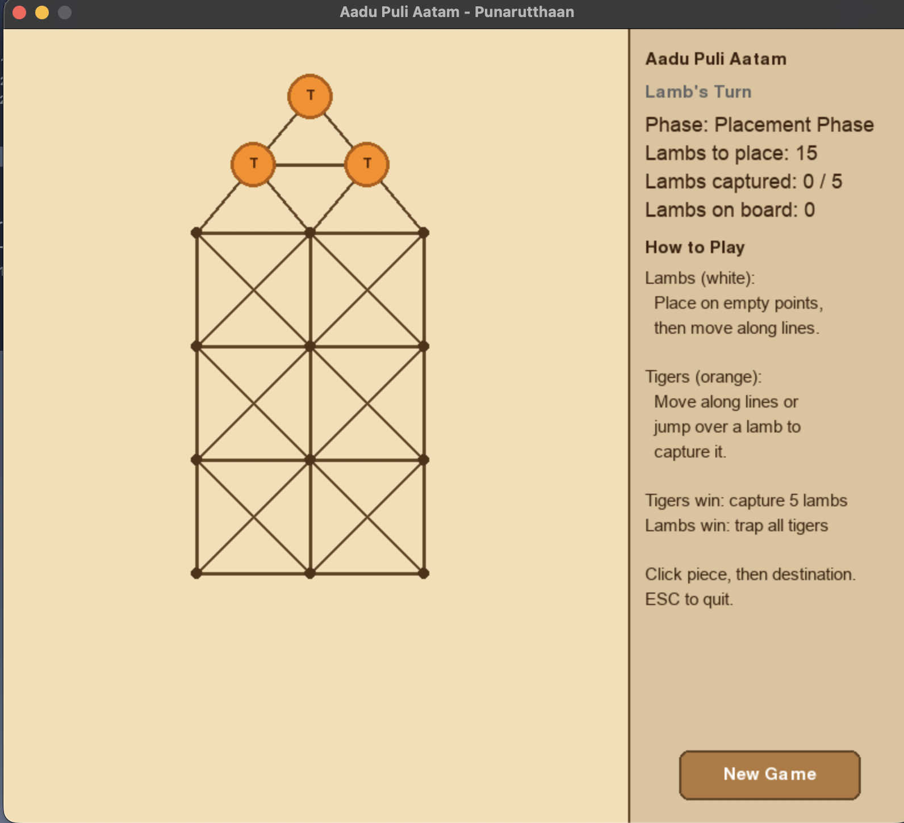

# 🎮 Punarutthaan — Ancient Indian Games

**Punarutthaan** (Tamil: புனருத்தான் — *revival*) is a collection of three classic Indian board games built with Pygame. The project brings traditional games of South India into a modern digital format, letting players experience the rich cultural heritage behind each game.

---

## 🎲 Games Included

| Game | Players | Description |
|------|---------|-------------|
| **Pallankuzhi** | 1 (vs Bot) | A South Indian mancala game played on a board with 14 pits and 84 cowrie shells. Sow seeds, capture by even counts, and outscore your opponent. |
| **Pagade** | 2–4 (Local) | The South Indian ancestor of Ludo/Pachisi. Race four pieces around a cross-shaped board, capture opponents, and reach home first. |
| **Aadu Puli Aatam** | 2 (Local) | *Goats and Tigers* — an asymmetric strategy game where 3 tigers try to capture 15 lambs, while the lambs try to trap all tigers. |

---

## 🚀 Getting Started

### Prerequisites

- Python 3.9 or higher
- pip (Python package manager)

### Installation

```bash
# Clone the repository
git clone https://github.com/marvelcodeX/Punarutthaan-Indian-Games-Online.git


# Create a virtual environment
python -m venv venv

# Activate it
# Windows:
venv\Scripts\activate
# macOS / Linux:
source venv/bin/activate

# Install dependencies
pip install -r requirements.txt
```

### Running the Game

```bash
python main.py
```

You can also run individual games directly:

```bash
python games/pallankuzhi.py
python games/pagade.py
python games/aadu_puli_aatam.py
```
---

### Controls

| Action | Key / Input |
|--------|-------------|
| Navigate menus | Mouse click |
| Scroll rules/history | Arrow keys / Mouse wheel |
| Return to menu | `ESC` |
| Quit | Close window |

---

## 📁 Project Structure

```
Punarutthaan-Ancient-Indian-Games/
├── main.py                    # Main menu launcher
├── requirements.txt           # Python dependencies
├── .gitignore
├── assets/                    # Images (thumbnails, background)
│   ├── background2.jpg
│   ├── pallankuzhi.jpg
│   ├── pagade.jpg
│   └── tiger_and_lambs.jpg
└── games/
    ├── __init__.py
    ├── pallankuzhi.py         # Pallankuzhi (vs Bot AI)
    ├── pagade.py              # Pagade / Ludo (2–4 players)
    └── aadu_puli_aatam.py     # Lambs & Tigers (2 players)
```
---

## 🎨 Features

- **Unified warm earthy UI** across all games — dark brown, cream, and gold palette
- **No external image assets needed** for game boards — everything drawn programmatically
- **In-app rules & history** — learn about each game's cultural background without leaving the app
- **Bot AI** for Pallankuzhi with strategic move selection
- **Multiplayer** support for Pagade (4 players) and Aadu Puli Aatam (2 players)

---

## 🛠️ Built With

- **[Python](https://www.python.org/)** — game logic and mechanics
- **[Pygame-CE](https://pyga.me/)** — rendering, input handling, and UI

---

## 🌏 Cultural Context

These three games have been played across South India for centuries:

- **Pallankuzhi** boards are carved into temple floors across Tamil Nadu, dating back to the Chola dynasty
- **Pagade** is mentioned in the Mahabharata; Emperor Akbar played life-sized versions at Fatehpur Sikri
- **Aadu Puli Aatam** boards are found etched into stone at the Virupaksha Temple in Hampi

This project aims to preserve and share these games with a new generation.

---

## 📸 Screenshots

| | |
|---|---|
|  |  |
|  |  |


> Launch the main menu and click any game to play. Each game card includes in-app **Rules** and **History** pages.

---

## 📝 License

While you’re welcome to use, explore and take inspiration from the project, please do not copy, reproduce, or reuse the code or design directly without permission.

---

## 🤝 Contributing

Contributions are welcome! Ideas for improvement:

- Sound effects (dice rolls, captures, victory)
- Online multiplayer via sockets
- AI opponents for Pagade and Aadu Puli Aatam
- Animated piece movement
- Save/load game state
- Mobile-friendly version

Feel free to open an issue or submit a pull request.
